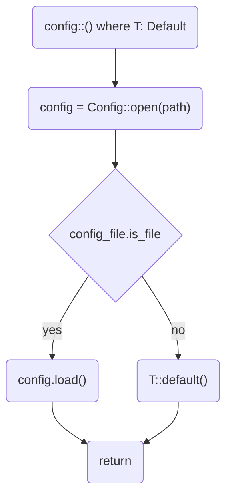

```mermaid
graph TD
  1("config::<T>() where T: Default")-->
  2("config = Config::open(path)")-->
  isf{"config_file.is_file"}
  isf-->|yes|isf_y("config.load()")-->e
  isf-->|no|isf_n("T::default()")-->e

  e("return")
```
